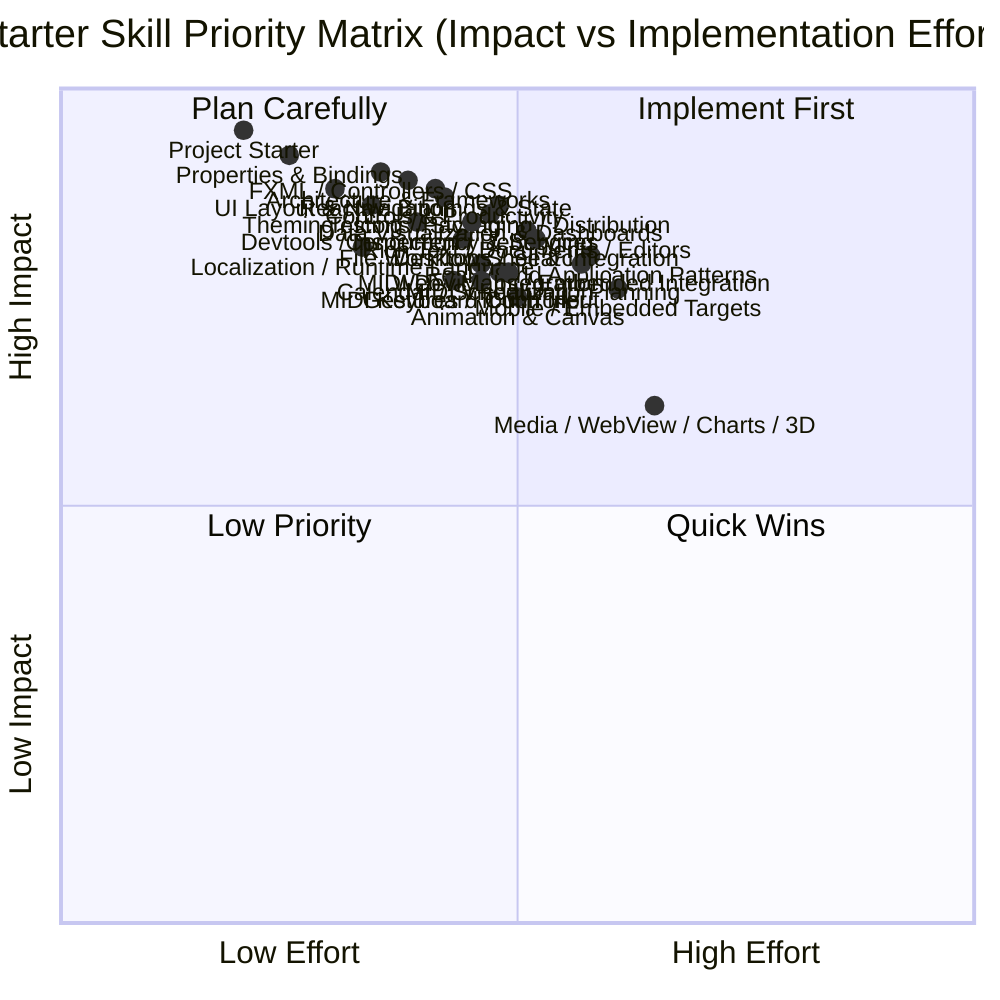

# JavaFX AI Coding Skills — Starter Catalogue

This catalogue defines the initial scope for JavaFX-focused AI coding skills. Each file contains
one or more Mermaid diagrams or notes for a concrete JavaFX domain that commonly needs reliable,
copyable implementation guidance. The current catalogue combines core JavaFX domains with
ecosystem-derived use cases extracted from the AwesomeJavaFX project.

## Domain Index

| File | Domain |
|------|--------|
| [uc-overview.md](uc-overview.md) | High-level map of JavaFX skill domains |
| [uc-application-lifecycle.md](uc-application-lifecycle.md) | `Application`, stage setup, startup, and shutdown |
| [uc-ui-layout-navigation.md](uc-ui-layout-navigation.md) | Scene graph composition, layout containers, and screen flow |
| [uc-properties-bindings-events.md](uc-properties-bindings-events.md) | Observable properties, bindings, listeners, and events |
| [uc-fxml-controls-css.md](uc-fxml-controls-css.md) | FXML loading, controller wiring, controls, and styling |
| [uc-concurrency-services.md](uc-concurrency-services.md) | `Task`, `Service`, background work, and FX thread safety |
| [uc-animation-canvas-game-loop.md](uc-animation-canvas-game-loop.md) | Animation APIs, `Timeline`, `Transition`, `Canvas`, and render loops |
| [uc-media-webview-charts-3d.md](uc-media-webview-charts-3d.md) | Media, `WebView`, charts, and the 3D scene graph |
| [uc-project-starter.md](uc-project-starter.md) | Docs-first project discovery and application scaffolding |
| [uc-architecture-frameworks.md](uc-architecture-frameworks.md) | MVC / MVP / MVVM, DI, routing, and reactive architecture choices |
| [uc-ecosystem-controls-productivity.md](uc-ecosystem-controls-productivity.md) | Third-party controls, forms, validation, theming, and dev tools |
| [uc-desktop-shell-integration.md](uc-desktop-shell-integration.md) | Docking, multi-document shells, custom stages, tray, and preferences |
| [uc-testing-packaging-distribution.md](uc-testing-packaging-distribution.md) | Test automation, installable builds, auto-updates, and deployment targets |
| [uc-real-world-application-patterns.md](uc-real-world-application-patterns.md) | Reusable app blueprints derived from real JavaFX products and tools |
| [uc-reactive-binding-state.md](uc-reactive-binding-state.md) | Advanced bindings, reactive streams, reducers, and synchronized UI state |
| [uc-theming-icons-styling.md](uc-theming-icons-styling.md) | Look-and-feel systems, icon packs, CSS builders, and live style workflows |
| [uc-data-visualization-dashboards.md](uc-data-visualization-dashboards.md) | Scientific charts, gauges, tiles, dashboards, and high-volume visualization |
| [uc-rich-text-documents-editors.md](uc-rich-text-documents-editors.md) | Rich text, PDF/document workflows, editor surfaces, and annotation tools |
| [uc-web-maps-embedded-integration.md](uc-web-maps-embedded-integration.md) | Browser embedding, web bridges, maps, and hybrid JavaFX/web delivery |
| [uc-devtools-inspection-debugging.md](uc-devtools-inspection-debugging.md) | Scene inspection, CSS hot reload, state debugging, and JavaFX tooling |
| [uc-awesome-javafx-ecosystem-map.md](uc-awesome-javafx-ecosystem-map.md) | Source-to-use-case map derived from the full AwesomeJavaFX inventory |
| [uc-calendar-scheduling-planning.md](uc-calendar-scheduling-planning.md) | Calendars, date-centric workflows, timeline planning, and Gantt-style scheduling |
| [uc-gestures-touch-input.md](uc-gestures-touch-input.md) | Gestures, pinch-to-zoom, touch surfaces, and multi-touch interaction design |
| [uc-file-workflows-search.md](uc-file-workflows-search.md) | File choosers, directory watching, search, import/export, and file-centric UI flows |
| [uc-localization-runtime-language.md](uc-localization-runtime-language.md) | Resource bundles, locale switching, and runtime language-aware JavaFX UIs |
| [uc-mobile-embedded-targets.md](uc-mobile-embedded-targets.md) | Mobile, embedded, browser-delivered, and multi-target JavaFX deployment patterns |
| [uc-midi-device-integration.md](uc-midi-device-integration.md) | Java Sound MIDI devices, sequencing, receivers, and FX-thread-safe UI bridges |
| [uc-midi-keyboard-controller.md](uc-midi-keyboard-controller.md) | Piano-keyboard controls, note mapping, and MIDI-driven key state in JavaFX |
| [uc-midi-visualization.md](uc-midi-visualization.md) | Piano rolls, waterfalls, note timelines, and chart-based MIDI visualization |

## Initial implementation priority

