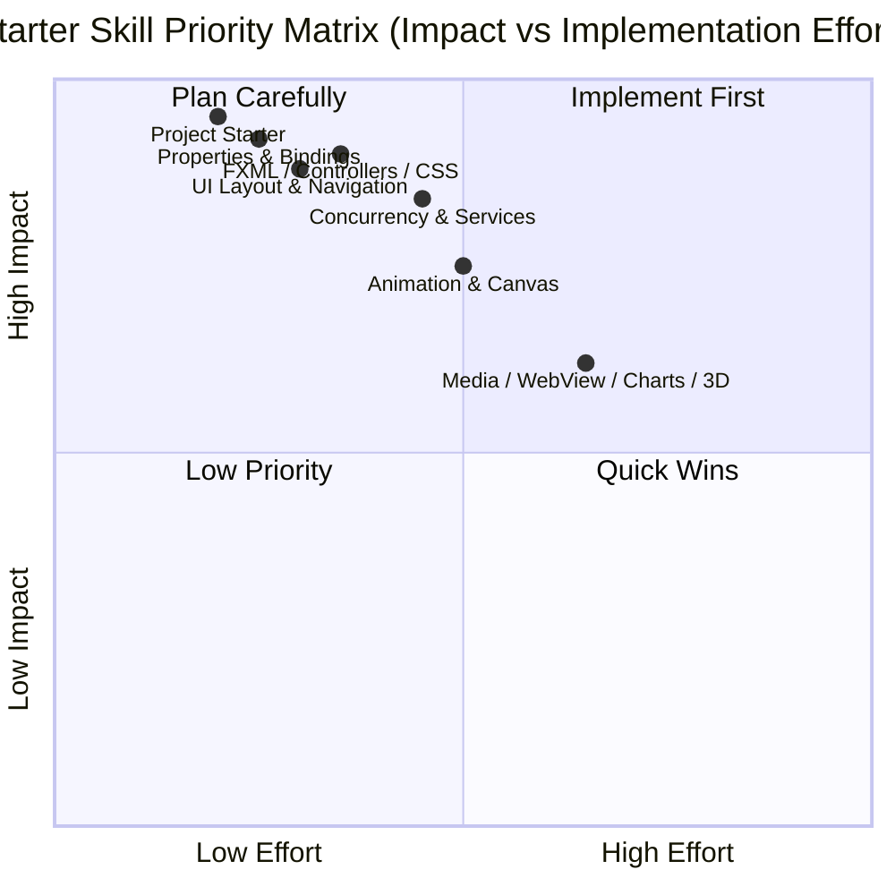

# JavaFX AI Coding Skills — Starter Catalogue

This catalogue defines the initial scope for JavaFX-focused AI coding skills. Each file contains
one or more Mermaid diagrams or notes for a concrete JavaFX domain that commonly needs reliable,
copyable implementation guidance.

## Domain Index

| File | Domain |
|------|--------|
| [uc-overview.md](uc-overview.md) | High-level map of JavaFX skill domains |
| [uc-application-lifecycle.md](uc-application-lifecycle.md) | `Application`, stage setup, startup, and shutdown |
| [uc-ui-layout-navigation.md](uc-ui-layout-navigation.md) | Scene graph composition, layout containers, and screen flow |
| [uc-properties-bindings-events.md](uc-properties-bindings-events.md) | Observable properties, bindings, listeners, and events |
| [uc-fxml-controls-css.md](uc-fxml-controls-css.md) | FXML loading, controller wiring, controls, and styling |
| [uc-concurrency-services.md](uc-concurrency-services.md) | `Task`, `Service`, background work, and FX thread safety |
| [uc-animation-canvas-game-loop.md](uc-animation-canvas-game-loop.md) | Animation APIs, `Timeline`, `Transition`, `Canvas`, and render loops |
| [uc-media-webview-charts-3d.md](uc-media-webview-charts-3d.md) | Media, `WebView`, charts, and the 3D scene graph |
| [uc-project-starter.md](uc-project-starter.md) | Docs-first project discovery and application scaffolding |

## Initial implementation priority

