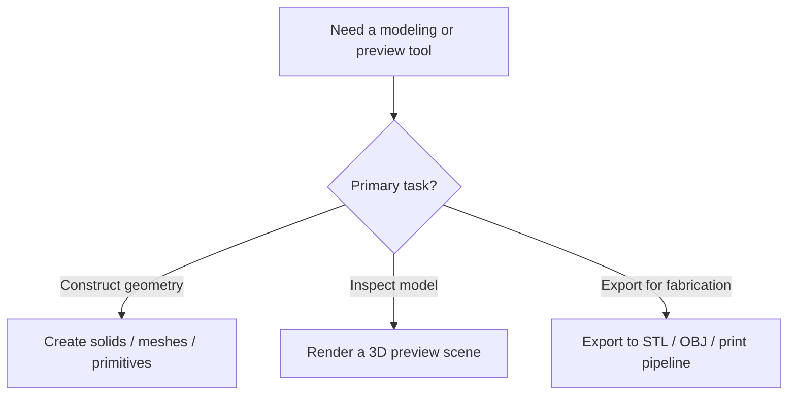
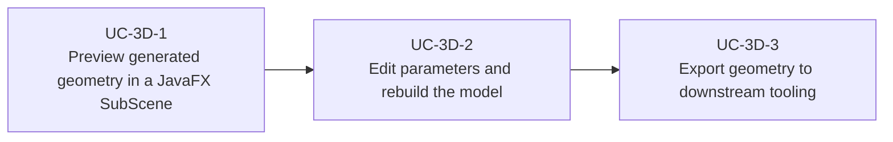

# Use Cases — JavaFX 3D Modeling and Printing

Derived from AwesomeJavaFX projects such as JCSG, JFXScad, FXyz, and other 3D or CAD-oriented
JavaFX tools.

## 3D Modeling Flow

## Primary Use Cases

## Skill opportunities

- Skill for using JavaFX 3D scene graph primitives as a modeling preview surface
- Skill for integrating CAD / solid geometry libraries with editable parameter panels
- Skill for keeping export and fabrication logic separate from 3D preview rendering

## Key gotchas

- JavaFX 3D preview is not the same thing as geometry generation or export.
- Mesh and CSG generation often belongs in a separate model layer.
- Export pipelines are library-specific; keep them isolated behind a narrow interface.
