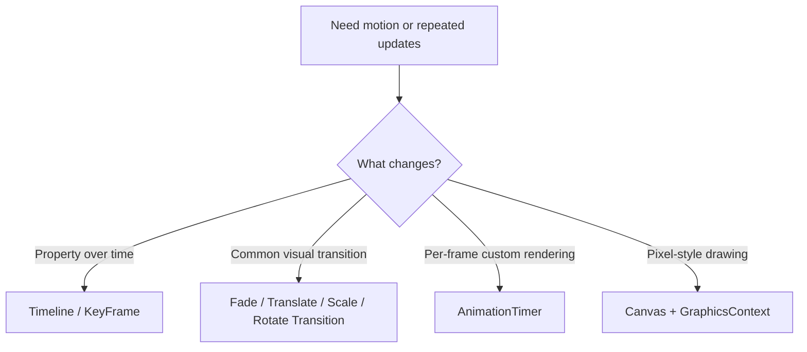
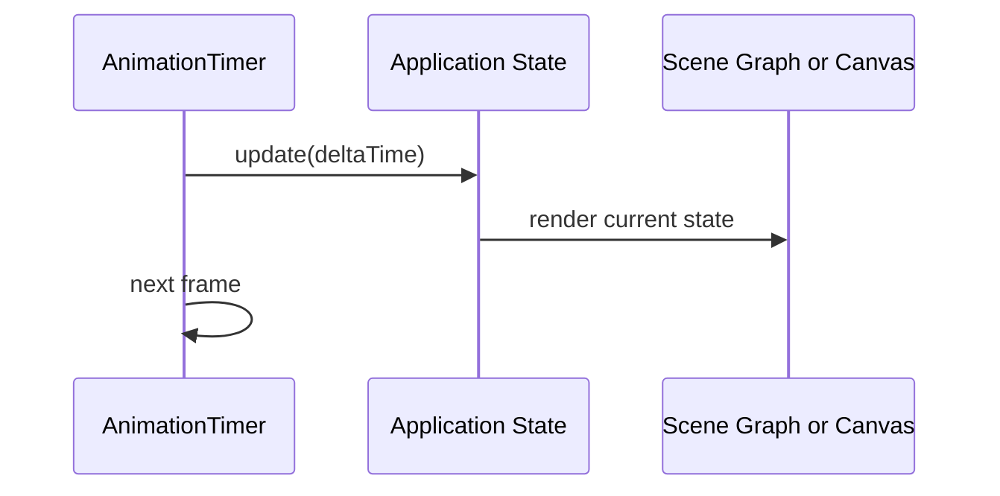

# Use Cases — JavaFX Animation, Canvas, and Render Loops

Covers timeline-based animation, transitions, immediate-mode rendering with `Canvas`, and simple
game-loop style updates using `AnimationTimer`.

## Animation Choice

## Loop Pattern

## Key gotchas

- Use `AnimationTimer` only when frame-by-frame control is actually required.
- `Canvas` is immediate mode; resizing and redraw strategy need to be explicit.
- Keep heavy simulation or IO off the FX thread even when the UI updates every frame.
