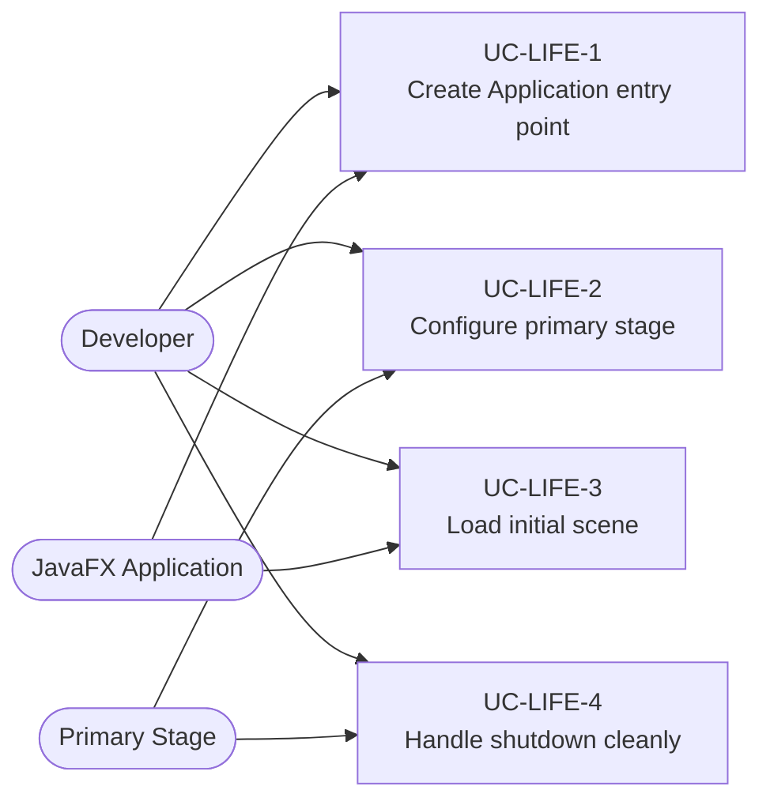
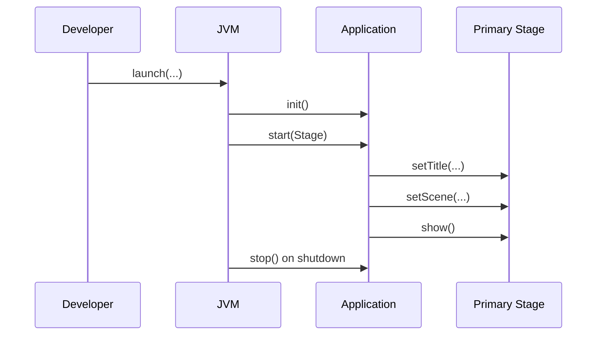

# Use Cases — JavaFX Application Lifecycle

Covers startup, shutdown, stage creation, and module-aware application scaffolding.

## Actors and Primary Use Cases

## Startup Flow

## Key gotchas

- Create and mutate UI state on the JavaFX Application Thread.
- Keep `init()` for non-UI setup; the `Stage` is only available in `start(...)`.
- Close background work explicitly in `stop()` when the application owns executors or services.
