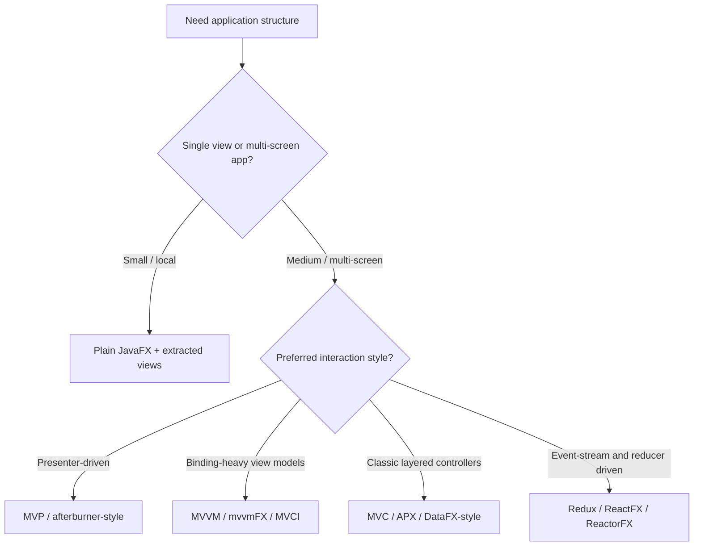
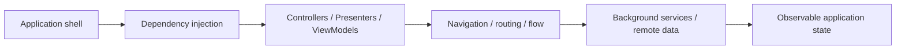
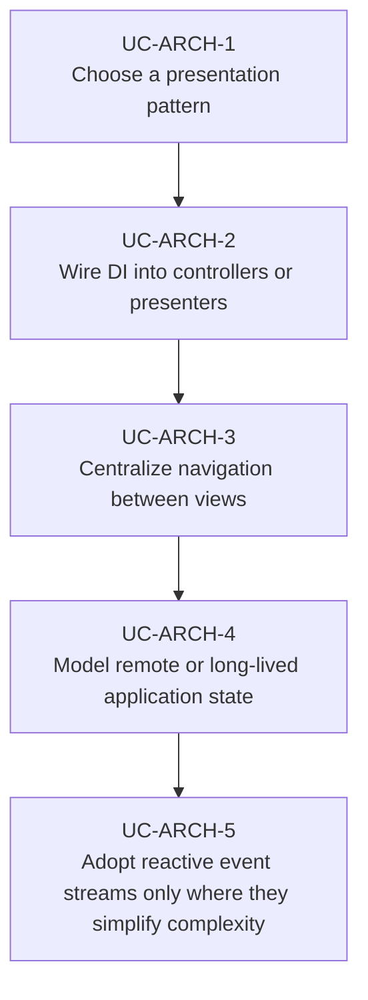

# Use Cases — JavaFX Architecture and Frameworks

Derived from the AwesomeJavaFX framework and library sections, this document captures the recurring
architectural choices that repeatedly show up in mature JavaFX applications: MVC / MVP / MVVM,
dependency injection, routing / flow management, and reactive state handling.

## Architecture Selection

## Dependency and Flow Decisions

## Primary Use Cases

## Candidate skills from this domain

- Skill for choosing between plain JavaFX, MVP, MVVM, MVCI, or reducer-based state models
- Skill for integrating DI with FXML controllers and application services
- Skill for navigation / flow orchestration across multi-screen desktop apps
- Skill for reactive state pipelines with JavaFX observables plus Reactor / Rx / ReactFX style APIs

## Key gotchas

- Do not force a framework onto a small app that only needs a few views and shared state.
- Keep thread ownership explicit when reactive or DI-managed services feed UI state.
- Prefer one navigation model per app; mixing ad-hoc scene swaps with framework routing becomes hard
  to reason about quickly.
