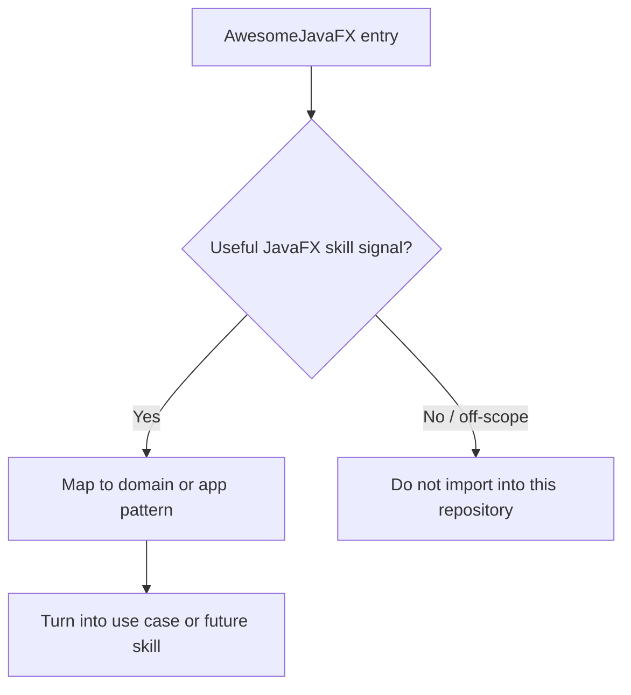
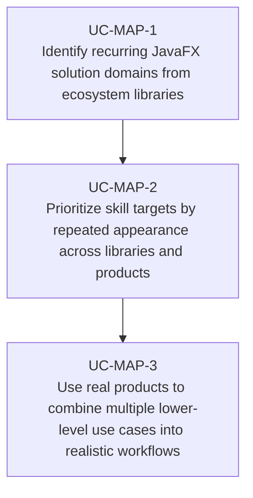

# Use Cases — AwesomeJavaFX Ecosystem Source Map

This document ties the current JavaFX use-case catalogue directly back to the audited
AwesomeJavaFX inventory.

## Audit summary

The AwesomeJavaFX README currently contains these high-signal sections:

| Section | Approx. entries | Use in this repository |
|---|---:|---|
| Libraries, Tools and Projects | 108 | Primary source for concrete skill opportunities |
| Frameworks | 21 | Primary source for architecture and workflow patterns |
| Real World Examples | 26 | Primary source for app blueprints and workflow combinations |
| Articles / Talks / Tutorials | 27+ | Supporting evidence for where skills need explanatory depth |

## Source-to-use-case map

| Use-case domain | Representative AwesomeJavaFX examples |
|---|---|
| Architecture and frameworks | afterburner.fx, mvvmFX, DataFX, ReactiveDeskFX, TabShell, WorkbenchFX |
| Reactive bindings and state | Advanced Bindings, EasyBind, ReactFX, ReactorFX, RxJavaFX, ReduxFX, SynchronizeFX |
| Controls, forms, validation, preferences | ControlsFX, FormsFX, FXForm2, FXValidation, ValidatorFX, PreferencesFX, SuggesterFX |
| Theming, icons, and styling | BootstrapFX, JMetro, JFoenix, MaterialFX, MonetFX, Ikonli, FontAwesomeFX, CssFX |
| Desktop shell and windowing | AnchorFX, DesktopPaneFX, TabPanePro, StagePro, CustomStage, FXTrayIcon, FXTaskbarProgressBar |
| Third-party controls and productivity widgets | ControlsFX, FormsFX, FXForm2, ValidatorFX, PreferencesFX, RichTextFX, GemsFX, FXRibbon, Toggle Switch |
| Charts, dashboards, and scientific views | ChartFx, Medusa, TilesFX, JavaFX Dashboard, Orson Charts, FlexGanttFX, JavaFX DataViewer |
| Rich text, documents, and editors | RichTextFX, RichTextArea, AsciidocFX, PDFsam Basic, EPUBCheckFX, graph editor, Mindolph |
| Web, browser, and maps integration | JxBrowser, Webview Debugger, GMapFX, Gluon Maps, javafx-d3, jpro, WebFX |
| Developer tooling and diagnostics | Scenic View, Component-Inspector, redux-javafx-devtool, Gluon Scene Builder, e(fx)clipse, JStackFX |
| Testing, packaging, and updates | TestFX, assertj-javafx, TestFX-dsl, FXLauncher, Update4j, Getdown, Maven jpackage Template |
| Terminal, workflow, and 3D modeling tools | JediTermFX, graph editor, VWorkflows, JFXNodeMapper, JCSG, JFXScad, FXyz |
| Real-world app blueprints | binjr, Bounding Box Editor, Everest, FXDesktopSearch, HMCL, Recaf, XR3Player, WavesFX |
| Calendar, scheduling, and planning | CalendarFX, FlexGanttFX, SkedPal, PI-Rail-FX |
| Gestures and touch interaction | GestureFX, TuioFX |
| File workflows and search | FXFileChooser, LiveDirsFX, SmartCSVFX, FXDesktopSearch, JFXNodeMapper |
| Localization and runtime language switching | Language Manager, VocabHunter, Welk Lidwoord |
| Mobile, embedded, and multi-target delivery | JavaFXPorts, JPro, WebFX, Raspberry Pi-focused books and tutorials |
| MIDI and music-oriented JavaFX tooling | Looking at Music talk, Musicott, OwlPlug, XR3Player, Musekeys-style MIDI visualizers |

## Extraction rules used here

## Primary use cases

## Key gotchas

- A curated ecosystem list mixes mature foundations, niche utilities, and historical artifacts; not
  every entry deserves a first-class skill.
- Real value comes from repeated patterns across many entries, not from copying one library name into
  a document.
- This repository should keep using the ecosystem as evidence for useful JavaFX workflows, not as a
  dependency list.
