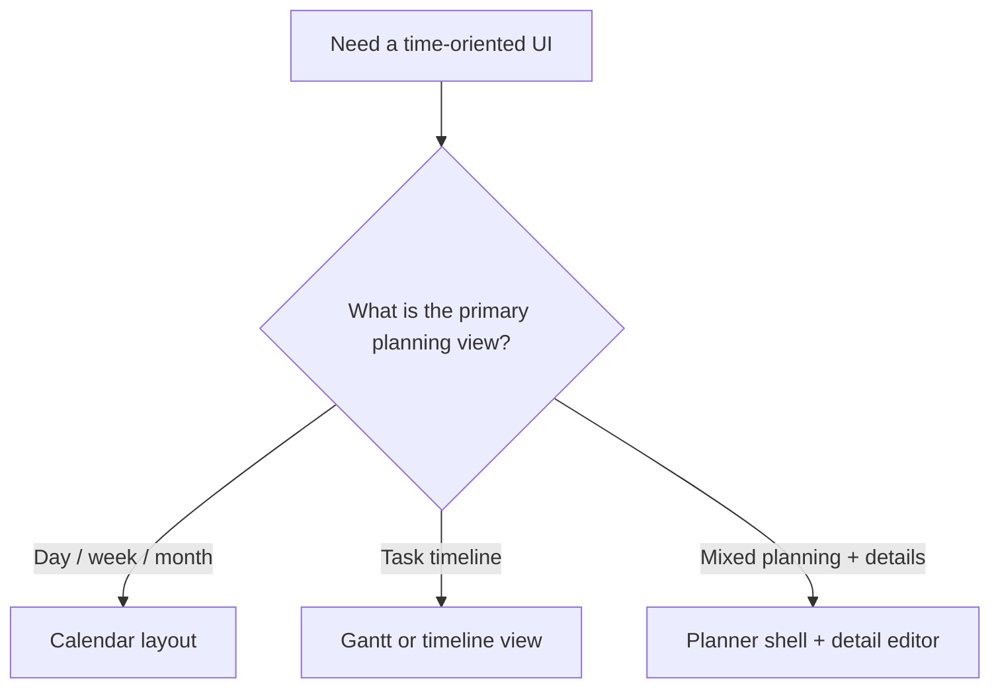
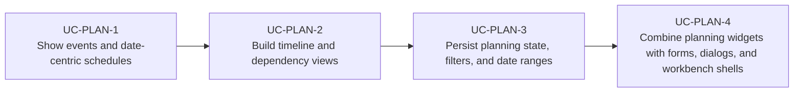

# Use Cases — JavaFX Calendar, Scheduling, and Planning

Derived from AwesomeJavaFX entries such as CalendarFX, FlexGanttFX, SkedPal, and PI-Rail-FX.

## Planning View Selection

## Primary Use Cases

## Key gotchas

- Date and time-zone handling becomes a product concern quickly.
- Calendar-style UIs need clear ownership of selection, editing, and overlap rules.
- Timeline and Gantt views usually need virtualization once the dataset grows.
