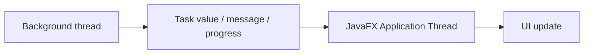
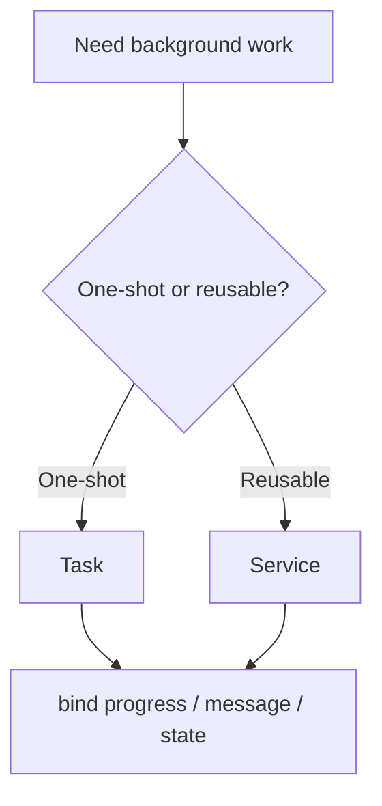

# Use Cases — JavaFX Concurrency and Services

Covers background tasks, service reuse, progress reporting, and safe UI updates.

## Threading Rule

## Worker Selection

## Key gotchas

- Never mutate scene graph nodes directly from `call()`.
- Prefer task state callbacks over manual polling.
- Propagate failure state visibly; do not swallow exceptions inside background work.
