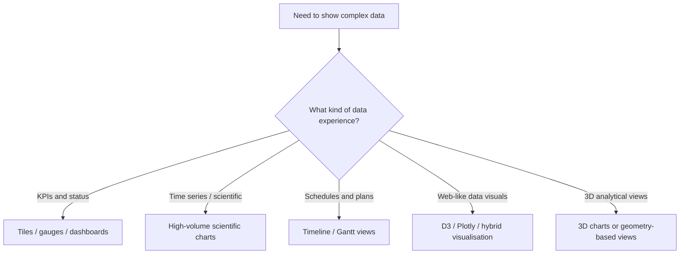
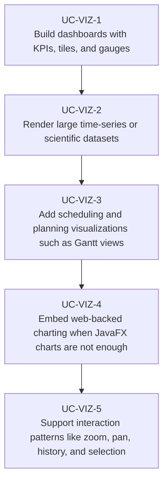

# Use Cases — JavaFX Data Visualization and Dashboards

Derived from AwesomeJavaFX entries such as ChartFx, Medusa, TilesFX, JavaFX Dashboard,
JavaFX DataViewer, Orson Charts, FXGraphics2D, javafx-d3, Kubed, FlexGanttFX, and scientific or
analytics-style real-world tools like binjr and Deep Space Trajectory Explorer.

## Visualization Choice

## Primary Use Cases

## Candidate skills from this domain

- Skill for dashboards with gauges, tiles, and status-oriented widgets
- Skill for real-time or high-volume charting in JavaFX
- Skill for hybrid charting using embedded web technologies when needed
- Skill for chart interaction patterns: zoom, drag, overlays, and history

## Key gotchas

- High-frequency updates need throttling and rendering strategy, not just faster charts.
- Scientific and dashboard widgets often need shared formatting, units, and color semantics.
- Hybrid chart stacks add a browser bridge and packaging implications that should stay explicit.
