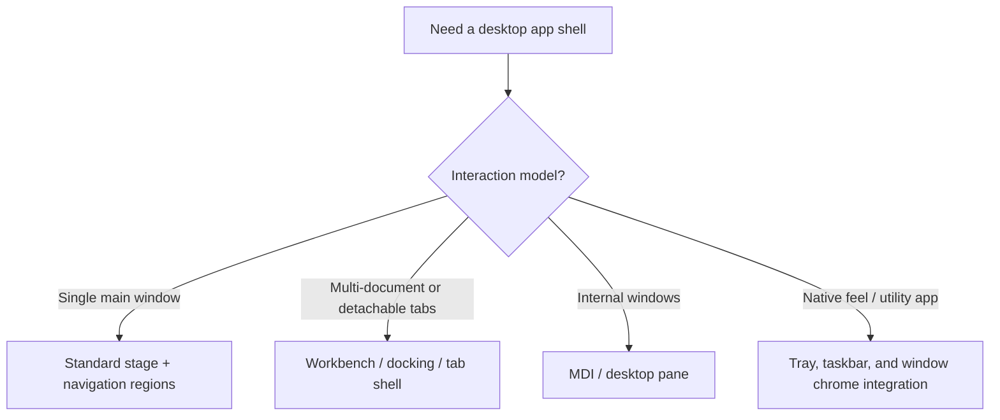
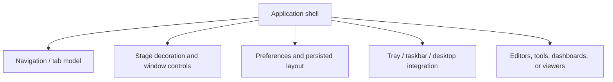
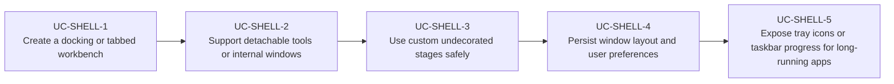

# Use Cases — JavaFX Desktop Shell and Integration

Derived from AwesomeJavaFX projects such as AnchorFX, DesktopPaneFX, WorkbenchFX, TabShell,
TabPanePro, StagePro, FX-BorderlessScene, FXTrayIcon, FXTaskbarProgressBar, CustomStage, and
PreferencesFX.

## Desktop Shell Topology

## Shell Composition

## Primary Use Cases

## Skill opportunities

- Skill for choosing between standard navigation, detachable tabs, docking, or MDI shells
- Skill for custom stage chrome, resizing, snapping, and platform-safe window controls
- Skill for desktop integration with tray menus, taskbar progress, and persisted user workspace

## Key gotchas

- Custom undecorated stages often break accessibility, resizing, and platform conventions unless
  carefully handled.
- Docking and detachable-tab shells need a durable layout persistence model from day one.
- Tray and taskbar features are platform-sensitive; support must degrade explicitly when unavailable.
