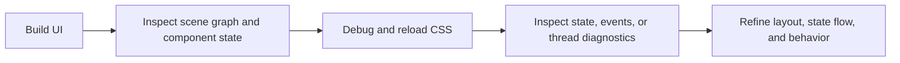
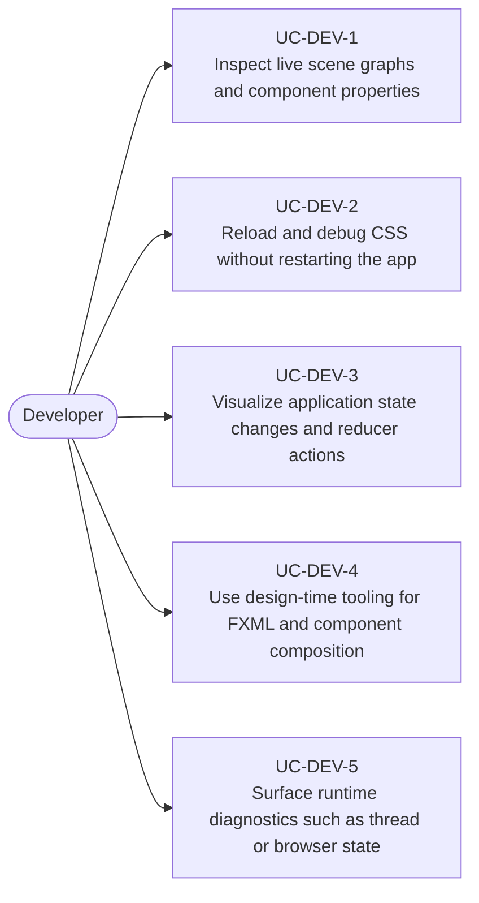

# Use Cases — JavaFX Devtools, Inspection, and Debugging

Derived from AwesomeJavaFX entries such as Scenic View, CssFX, Component-Inspector,
redux-javafx-devtool, Gluon Scene Builder, e(fx)clipse, Webview Debugger, and diagnostic apps such
as JStackFX.

## Tooling Workflow

## Primary Use Cases

## Candidate skills from this domain

- Skill for scene-graph inspection and layout troubleshooting
- Skill for CSS iteration workflows and visual debugging
- Skill for state-devtool integration in reactive JavaFX apps
- Skill for design-time tooling with Scene Builder and IDE support

## Key gotchas

- Debug tooling is most useful when it is built into the development workflow, not added after UI
  complexity explodes.
- CSS and state debugging should not leak into production builds unintentionally.
- Tooling that introspects browser state, reducers, or threads needs explicit separation from user
  features.
