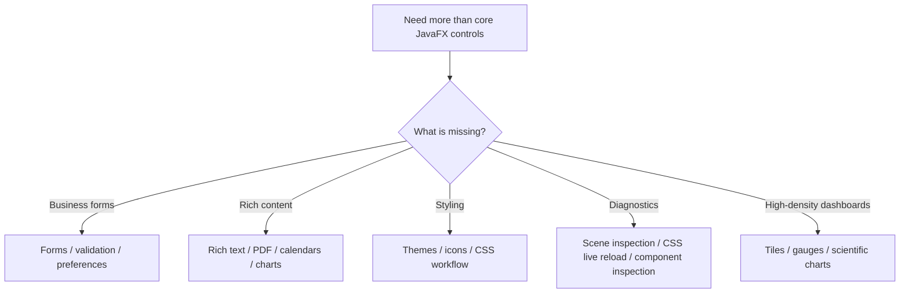
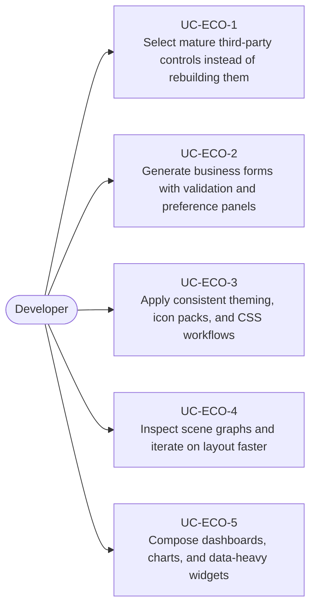

# Use Cases — JavaFX Ecosystem Controls and Productivity

Derived from AwesomeJavaFX entries such as ControlsFX, FormsFX, ValidatorFX, PreferencesFX,
RichTextFX, RichTextArea, CalendarFX, ChartFx, Medusa, TilesFX, MaterialFX, BootstrapFX, JMetro,
Scenic View, and CssFX.

## Ecosystem Decision Flow

## Primary Use Cases

## Skill opportunities

- Skill for evaluating when to use ControlsFX, FormsFX, ValidatorFX, or PreferencesFX
- Skill for integrating rich text, calendar, chart, and dashboard components into a JavaFX shell
- Skill for theming with JMetro, BootstrapFX, MaterialFX, icon packs, and CSS reload workflows
- Skill for developer tooling with Scenic View, CssFX, and component inspection utilities

## Key gotchas

- Third-party controls often bring their own CSS expectations; theme conflicts are common.
- Validation, forms, and preferences should share a single state model instead of separate copies of
  the same settings.
- Rich widgets can increase startup cost and styling complexity, so isolate them behind reusable
  modules rather than scattering direct dependencies everywhere.
