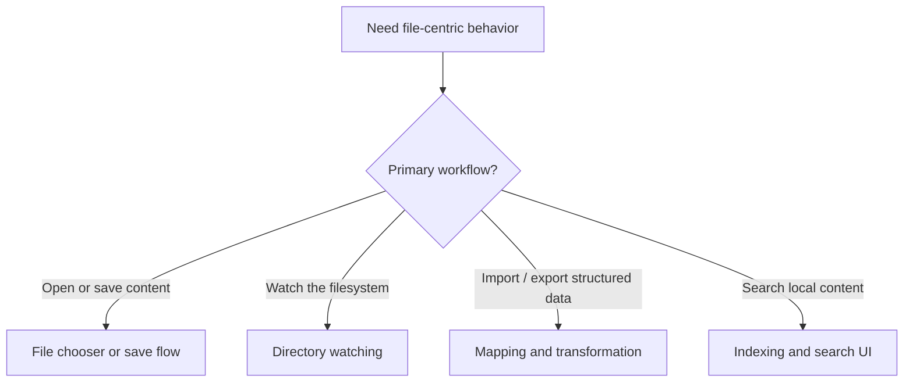

# Use Cases — JavaFX File Workflows and Search

Derived from AwesomeJavaFX entries such as FXFileChooser, LiveDirsFX, SmartCSVFX, JFXNodeMapper,
Figures, and FXDesktopSearch.

## File Workflow Selection

## Primary Use Cases

## Key gotchas

- Long-running file scans and indexing must stay off the FX thread.
- File and directory workflows need explicit error and permission handling.
- Search results often need virtualization and incremental refresh.
