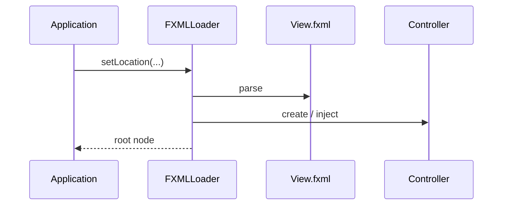
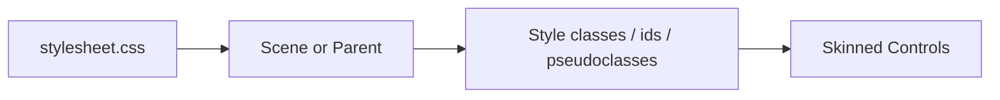

# Use Cases — JavaFX FXML, Controls, and CSS

Covers declarative views, controller wiring, common controls, and stylesheet-driven customization.

## FXML Loading Path

## Styling Flow

## Key gotchas

- `fx:id` requires matching controller fields and `@FXML` where needed.
- Resource loading failures usually come from incorrect classpath-relative paths.
- Prefer style classes over inline styles so themes stay reusable.
