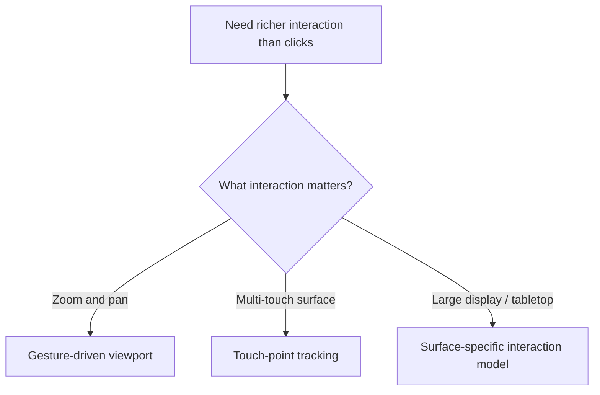
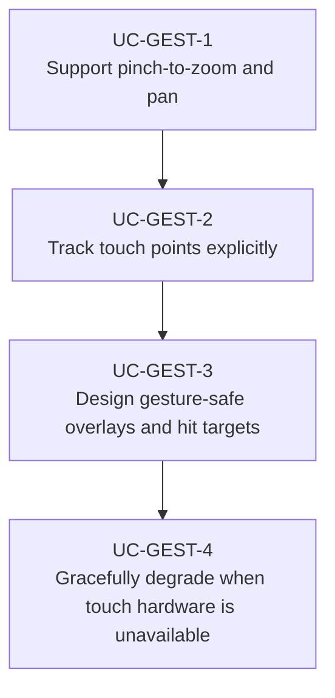

# Use Cases — JavaFX Gestures and Touch Input

Derived from AwesomeJavaFX entries such as GestureFX and TuioFX.

## Interaction Flow

## Primary Use Cases

## Key gotchas

- Gesture handling and mouse handling need a coordinated ownership model.
- Zoomable surfaces require explicit coordinate transforms.
- Multi-touch availability differs by hardware and target platform.
