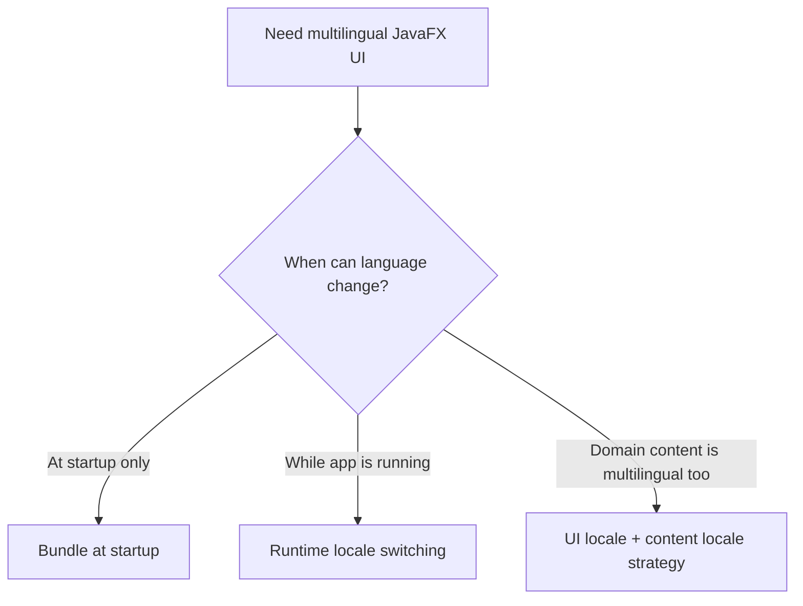
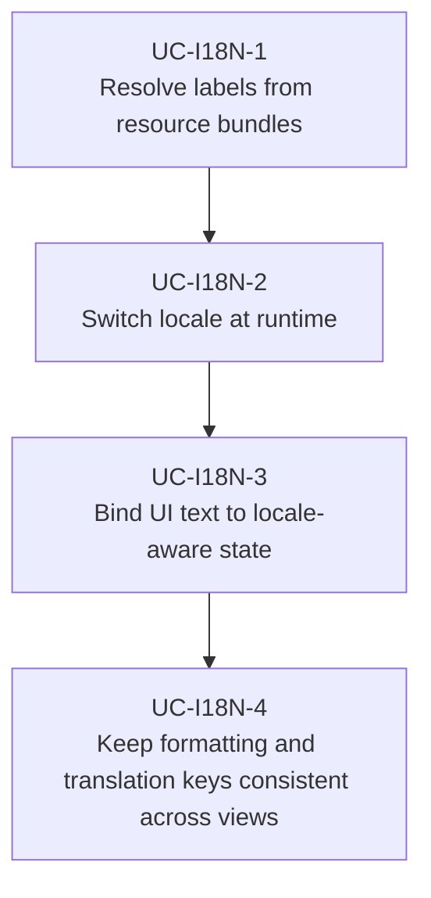

# Use Cases — JavaFX Localization and Runtime Language

Derived from AwesomeJavaFX entries such as Language Manager, VocabHunter, and Welk Lidwoord.

## Localization Strategy

## Primary Use Cases

## Key gotchas

- Runtime language switching is harder than startup-only localization.
- Translation keys, formatting rules, and pluralization must stay separate from widget code.
- Long text expansion changes layout assumptions quickly.
