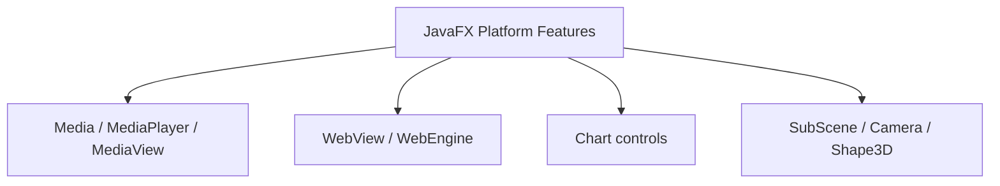
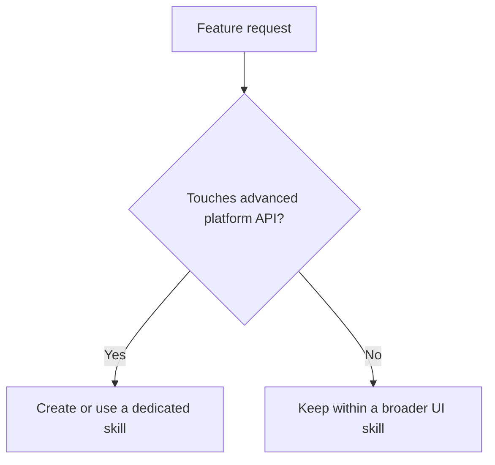

# Use Cases — JavaFX Media, WebView, Charts, and 3D

Covers higher-level platform features that often deserve dedicated skills.

## Feature Buckets

## When to Split Into Dedicated Skills

## Key gotchas

- Media codecs and platform packaging requirements vary by target environment.
- `WebView` embeds a browser engine; expose only the minimum needed bridge surface.
- JavaFX 3D is scene-graph based and separate from any external game engine workflow.
