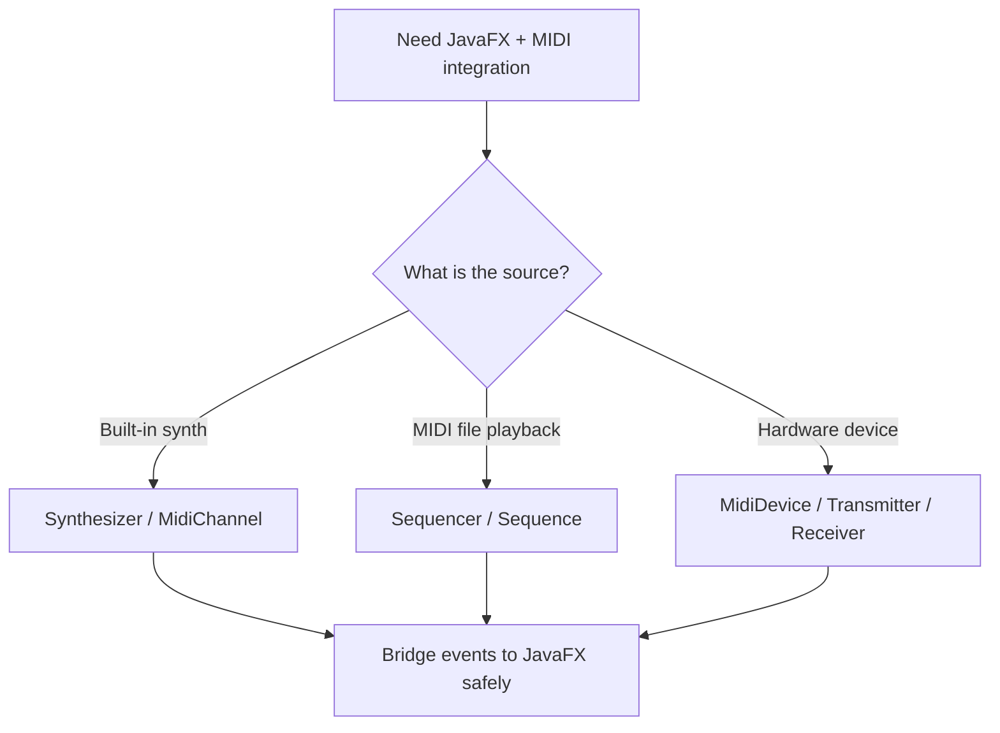
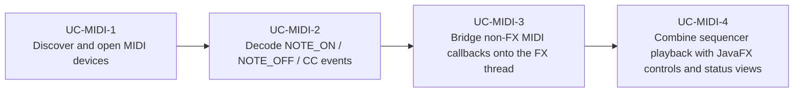

# Use Cases — JavaFX MIDI Device Integration

Derived from JavaFX MIDI examples and tools such as AlmasB's `MidiApp`, Musekeys, Arpeggiatorum,
forge-groovebox, EWItool, and MIDI-oriented JavaFX talks.

## Integration Flow

## Primary Use Cases

## Key gotchas

- `Receiver.send(...)` is not called on the JavaFX Application Thread.
- `NOTE_ON` with velocity `0` must be treated as `NOTE_OFF`.
- Modular JavaFX projects need `requires java.desktop;` for `javax.sound.midi`.
