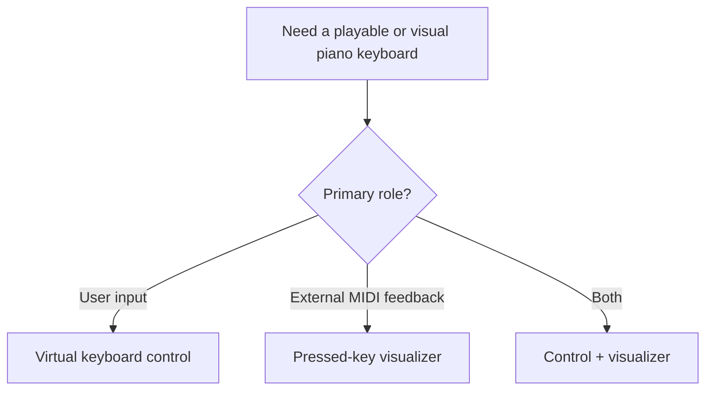
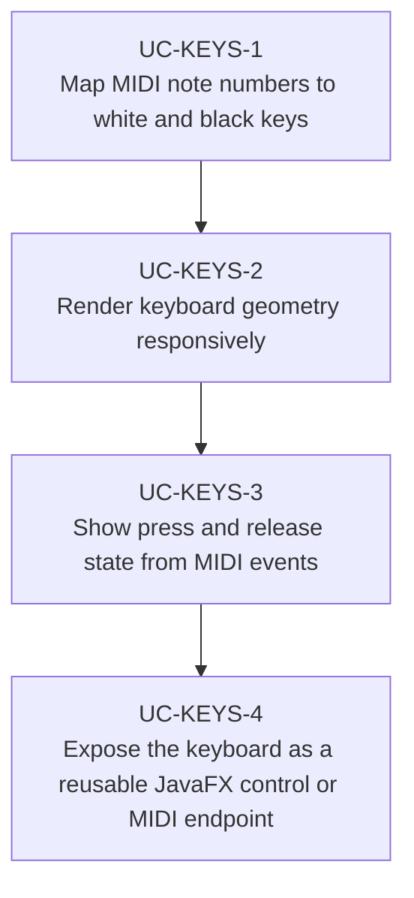

# Use Cases — JavaFX MIDI Keyboard Controller

Derived from JavaFX piano-keyboard implementations such as Musekeys and Karedi-style piano views.

## Keyboard Control Model

## Primary Use Cases

## Key gotchas

- Black-key layering and note mapping are easy to get subtly wrong.
- Zooming or resizing the keyboard changes key geometry assumptions.
- MIDI-driven key updates still need FX-thread-safe visual state changes.
