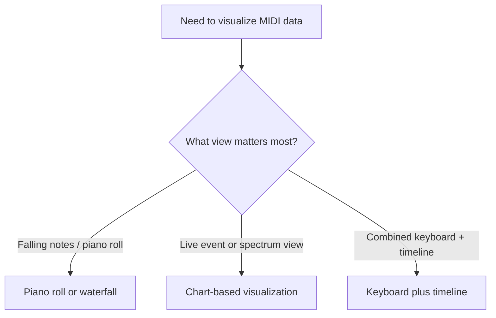
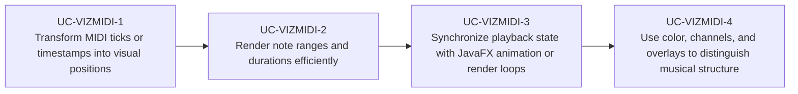

# Use Cases — JavaFX MIDI Visualization

Derived from JavaFX MIDI visualizers such as Musekeys waterfalls, chart-driven analyzers, and
music-focused talks about JavaFX plus MIDI.

## Visualization Choice

## Primary Use Cases

## Key gotchas

- Real-time visualizers can flood `Platform.runLater(...)` if updates are not batched.
- Tick-to-time conversion needs an explicit timing model.
- Long files and dense note streams benefit from pooling or virtualization.
