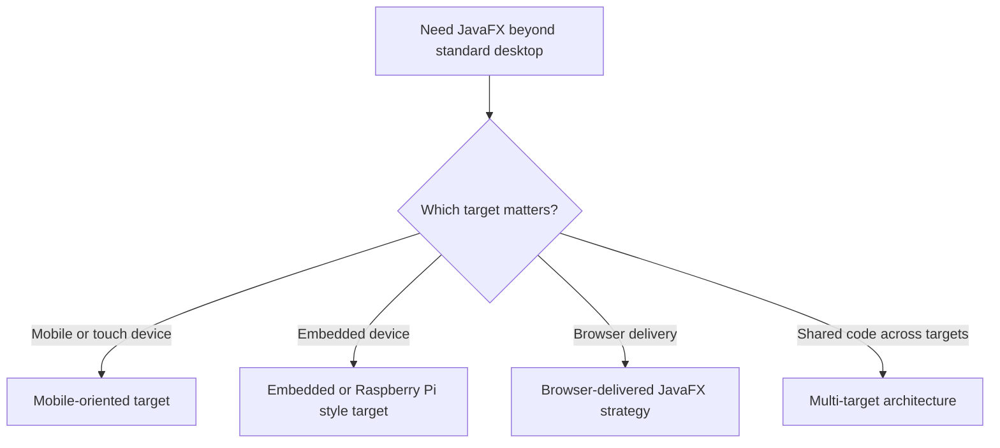
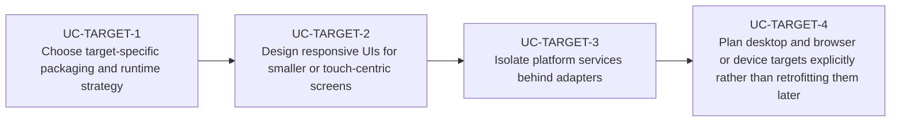

# Use Cases — JavaFX Mobile, Embedded, and Multi-Target Delivery

Derived from AwesomeJavaFX entries such as JavaFXPorts, JPro, WebFX, and Raspberry Pi or mobile
learning resources referenced by the curated list.

## Target Strategy

## Primary Use Cases

## Key gotchas

- Desktop assumptions break quickly on mobile, browser, and embedded targets.
- Input hardware, media support, and performance profiles vary materially between targets.
- Multi-target delivery works best when platform services are abstracted early.
