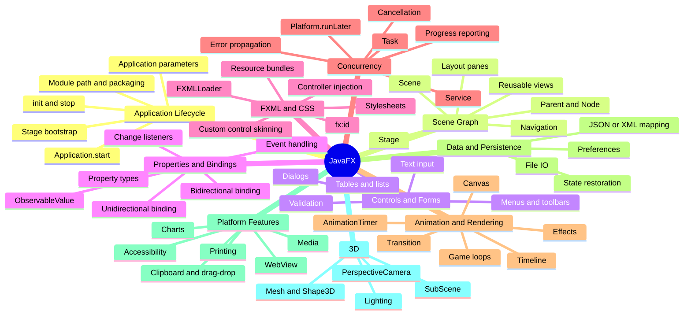

# JavaFX — Full Domain Overview

A bird's-eye view of the initial JavaFX skill areas this repository is meant to cover.

```mermaid
mindmap
  root((JavaFX))
    Application Lifecycle
      Application.start
      init and stop
      Stage bootstrap
      Application parameters
      Module path and packaging
    Scene Graph
      Stage
      Scene
      Parent and Node
      Layout panes
      Navigation
      Reusable views
    Controls and Forms
      Text input
      Tables and lists
      Validation
      Dialogs
      Menus and toolbars
    Properties and Bindings
      ObservableValue
      Property types
      Unidirectional binding
      Bidirectional binding
      Change listeners
      Event handling
    FXML and CSS
      FXMLLoader
      Controller injection
      fx:id
      Resource bundles
      Stylesheets
      Custom control skinning
    Concurrency
      Platform.runLater
      Task
      Service
      Progress reporting
      Cancellation
      Error propagation
    Animation and Rendering
      Timeline
      Transition
      AnimationTimer
      Canvas
      Effects
      Game loops
    Data and Persistence
      Preferences
      File IO
      JSON or XML mapping
      State restoration
    Platform Features
      Media
      WebView
      Charts
      Clipboard and drag-drop
      Printing
      Accessibility
    3D
      SubScene
      PerspectiveCamera
      Mesh and Shape3D
      Lighting
```
