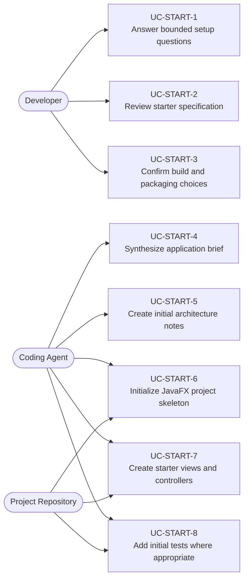
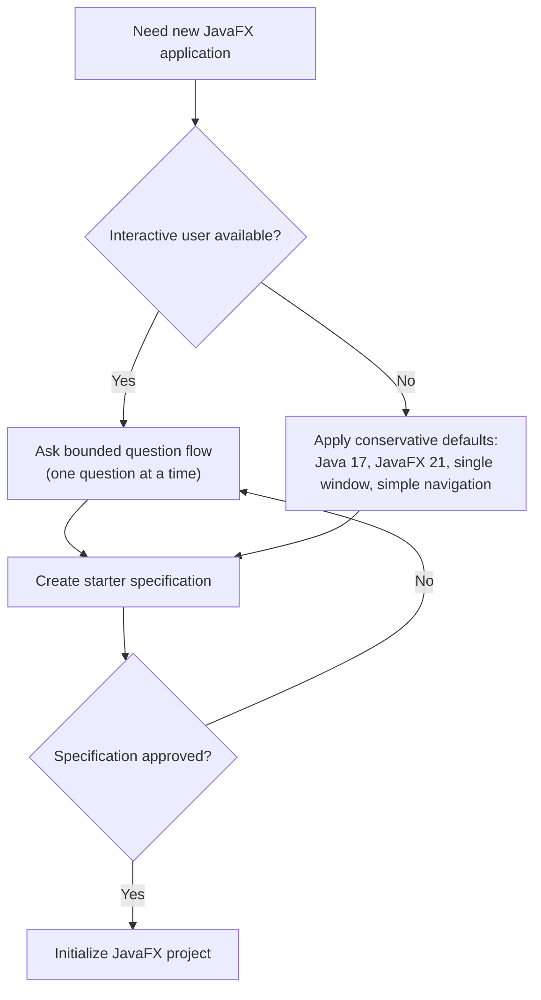
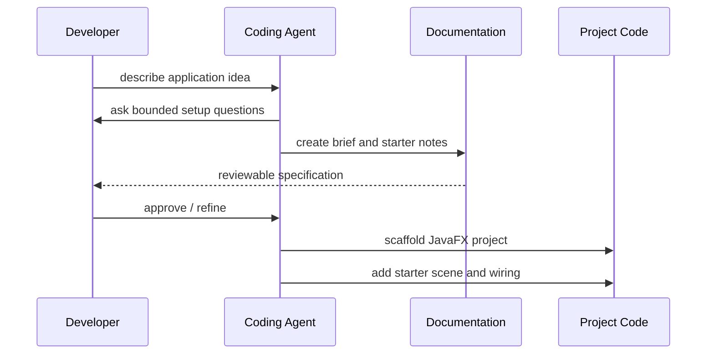

# Use Cases — JavaFX Project Starter Workflow

Covers interactive project discovery, docs-first specification, and scaffolding for new JavaFX
applications.

## Actors and Primary Use Cases

## Interactive vs Default Path

## Delivery Flow

