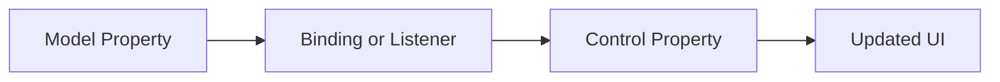
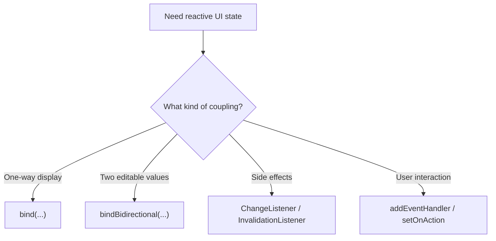

# Use Cases — JavaFX Properties, Bindings, and Events

Covers observable state, property binding, listeners, and event handling patterns.

## Property and Binding Flow

## Common Patterns

## Key gotchas

- Bindings are great for derived values; avoid mutating a bound property directly.
- Prefer observable properties on presentation models that the UI can bind to cleanly.
- Use listeners for side effects, not as a substitute for all data flow.
