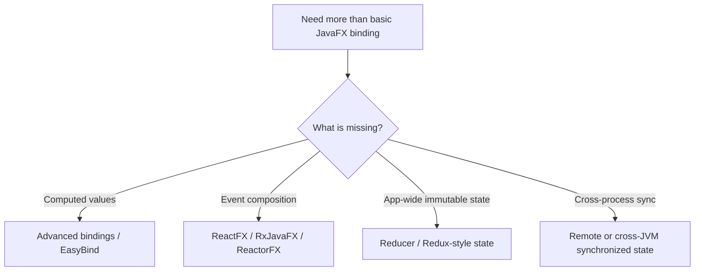
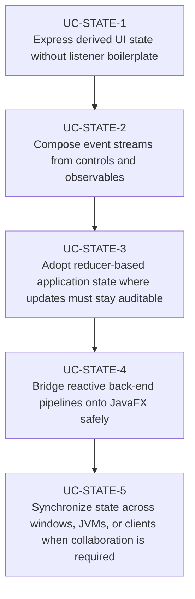

# Use Cases — JavaFX Reactive Bindings and State

Derived from AwesomeJavaFX entries such as Advanced Bindings, EasyBind, ReactFX, ReactorFX,
RxJavaFX, ReduxFX, SynchronizeFX, MVCI Framework, and mvciFX.

## State Model Selection

## Primary Use Cases

## Candidate skills from this domain

- Skill for advanced JavaFX binding patterns and computed observable values
- Skill for reactive event pipelines with JavaFX controls and collections
- Skill for reducer-style state stores and time-travel-friendly app architecture
- Skill for synchronizing reactive or remote state into a JavaFX UI

## Key gotchas

- Reactive pipelines still need explicit FX-thread handoff before mutating the UI.
- Reducer-based state helps with auditability, but overcomplicates small forms quickly.
- Cross-window or cross-JVM synchronization requires conflict and ownership rules, not just bindings.
