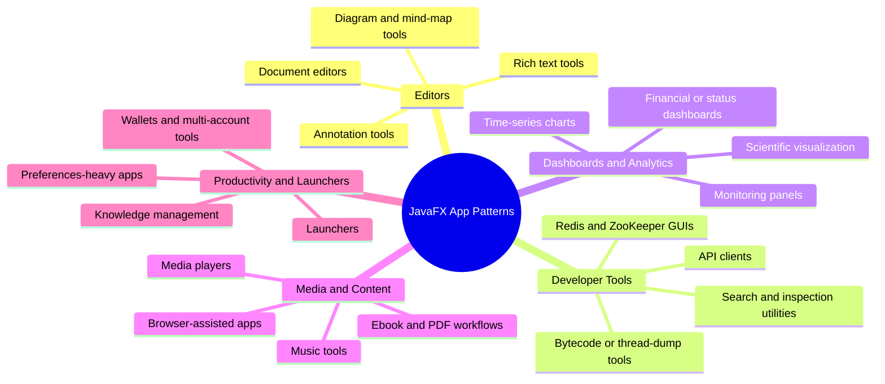
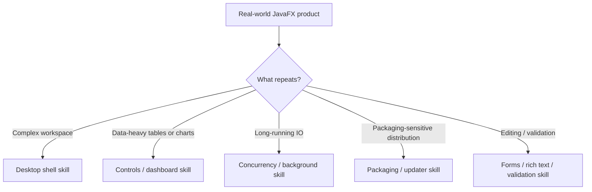

# Use Cases — Real-World JavaFX Application Patterns

Derived from the AwesomeJavaFX real-world examples section, which highlights recurring application
types rather than isolated widgets: editors, developer tools, dashboards, media apps, launchers,
search tools, and knowledge-management software.

## Product Pattern Clusters

## Use-Case Extraction Flow

## Skill opportunities

- Skill for editor-style apps with tool panes, documents, and persisted workspace state
- Skill for developer-tool UIs that need tables, trees, search, logs, and async operations
- Skill for dashboard and analytics apps with real-time charts and high-density status components
- Skill for content-centric apps combining media, WebView, rich text, and file workflows

## Key gotchas

- Real products usually combine several JavaFX domains; single-feature skills are rarely enough.
- Search, indexing, file IO, and preview pipelines almost always require careful background-task
  design.
- Workspace persistence, import / export, and error reporting are often the difference between a
  demo and a usable desktop application.
