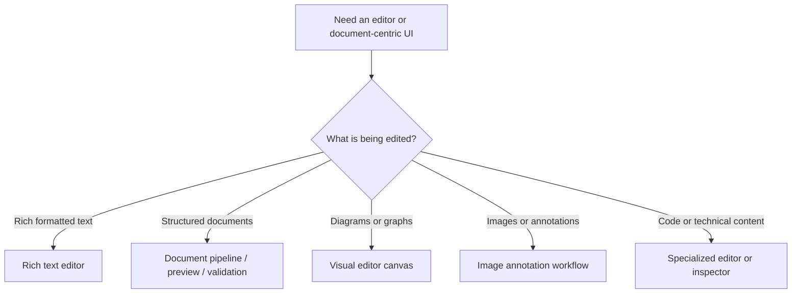
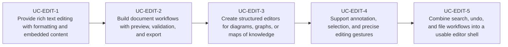

# Use Cases — JavaFX Rich Text, Documents, and Editors

Derived from AwesomeJavaFX entries such as RichTextFX, RichTextArea, GemsFX PDF viewer, AsciidocFX,
PDFsam Basic, EPUBCheckFX, Bounding Box Editor, graph editor, Mindolph, Recaf, and other editor-like
real-world applications.

## Editor Surface Selection

## Primary Use Cases

## Candidate skills from this domain

- Skill for rich text editor composition and formatting toolbars
- Skill for document preview, validation, and export-oriented desktop apps
- Skill for visual editors with selection, drag handles, overlays, and undo / redo
- Skill for editor workspace patterns: tabs, side panels, search, history, and file management

## Key gotchas

- Editor apps need undo, selection, clipboard, and persistence from the beginning.
- Rich document workflows usually require background parsing and preview generation.
- Annotation and graph editors depend heavily on hit-testing, zooming, and coordinate transforms.
