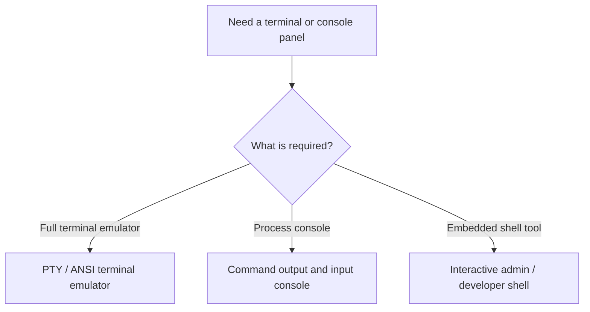
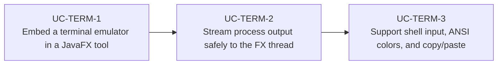

# Use Cases — JavaFX Terminal Emulators and Console UIs

Derived from AwesomeJavaFX projects such as JediTermFX and terminal-like developer tools that need
embedded shells, process consoles, or ANSI-aware log panes.

## Terminal UI Flow

## Primary Use Cases

## Skill opportunities

- Skill for choosing between a true terminal emulator and a simpler process console
- Skill for bridging background process I/O to JavaFX controls without freezing the UI
- Skill for handling ANSI escape sequences, scrolling, and clipboard behavior consistently

## Key gotchas

- A terminal emulator is not just a `TextArea`; it needs cursor, keyboard, and ANSI handling.
- Process I/O must be read on background threads and marshalled back to the FX thread only for UI
  updates.
- Interactive shells often need platform-specific PTY support rather than raw stdin/stdout pipes.
