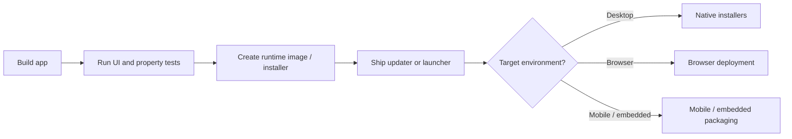
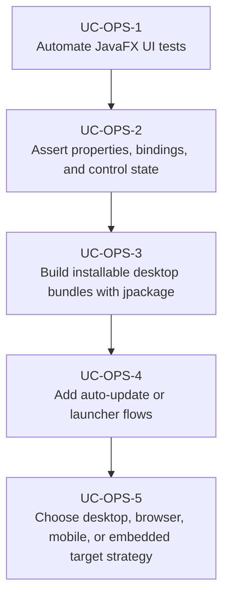

# Use Cases — JavaFX Testing, Packaging, and Distribution

Derived from AwesomeJavaFX entries such as TestFX, assertj-javafx, TestFX-dsl, FXLauncher,
Update4j, Maven jpackage Template, Getdown, JavaFXPorts, JPro, WebFX, and ecosystem articles about
`jpackage`.

## Delivery Lifecycle

## Primary Use Cases

## Skill opportunities

- Skill for TestFX-based UI automation and robust scene-graph assertions
- Skill for packaging JavaFX apps with `jlink` and `jpackage`
- Skill for auto-update and launcher integration with Update4j or FXLauncher-style flows
- Skill for selecting desktop vs browser vs mobile / embedded distribution models

## Key gotchas

- UI tests fail nondeterministically when background work, dialogs, or animations are not accounted
  for explicitly.
- Packaging must match the app's module graph and native dependencies, especially for media and
  WebView.
- Browser and mobile targets change the deployment model enough that they should be treated as
  separate product decisions, not late packaging tweaks.
