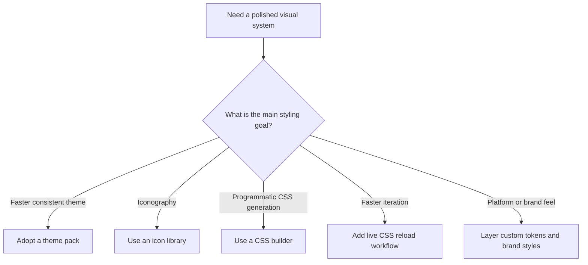
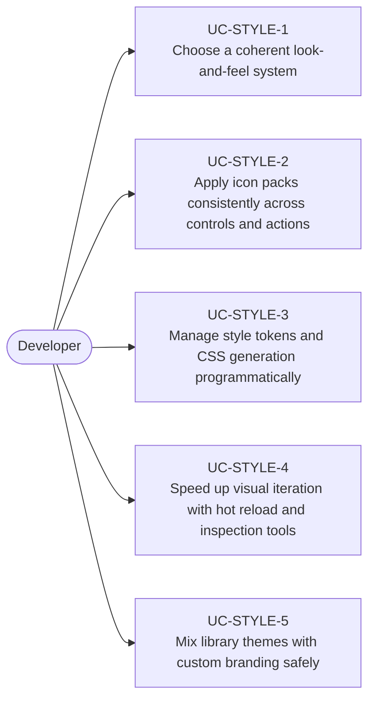

# Use Cases — JavaFX Theming, Icons, and Styling

Derived from AwesomeJavaFX entries such as BootstrapFX, JMetro, MaterialFX, JFoenix, MonetFX,
FontAwesomeFX, Ikonli, FluentFxCss, CssFX, FroXty, SyntheticaFX, and related styling tools.

## Styling Strategy

## Primary Use Cases

## Candidate skills from this domain

- Skill for selecting and integrating JavaFX theme libraries
- Skill for icon pack usage and action-driven visual language
- Skill for scalable CSS architecture, tokens, and programmatic style generation
- Skill for hot-reload styling workflows during UI development

## Key gotchas

- Theme libraries and third-party controls often disagree on class names and CSS assumptions.
- Inline styles are convenient for prototypes but undermine reusable theming.
- Material or fluent-inspired libraries can shape the whole component strategy, not just colors.
