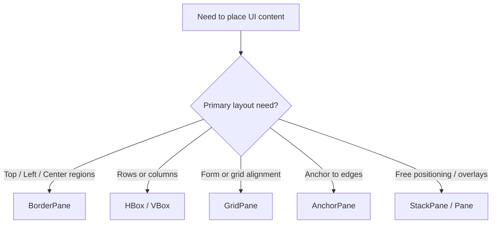
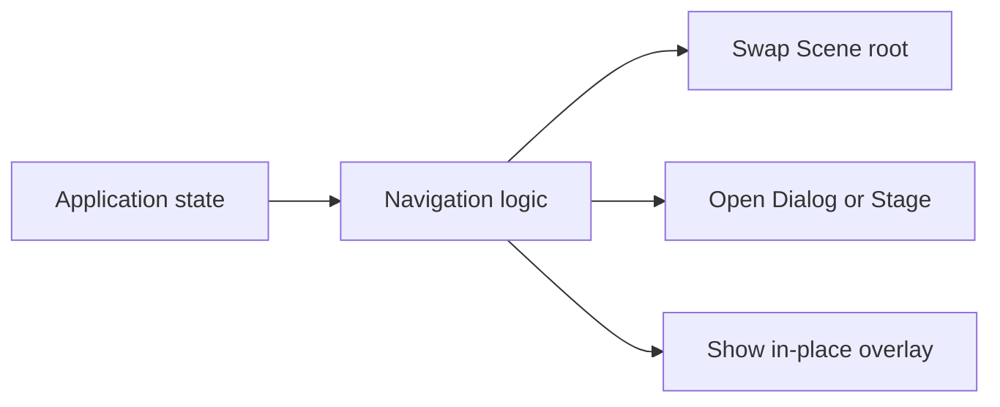

# Use Cases — JavaFX UI Layout and Navigation

Covers scene graph composition, layout panes, reusable views, and screen transitions.

## Layout Selection

## Navigation Model

## Key gotchas

- Prefer swapping the root or center content over creating many top-level windows.
- Keep navigation state outside individual controls when multiple views need to coordinate.
- Use layout panes before absolute positioning; `Pane` should be the exception, not the default.
