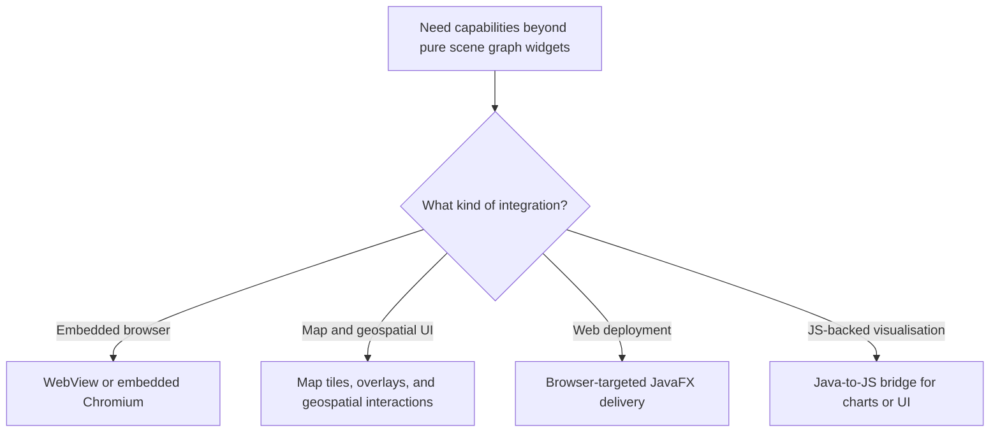
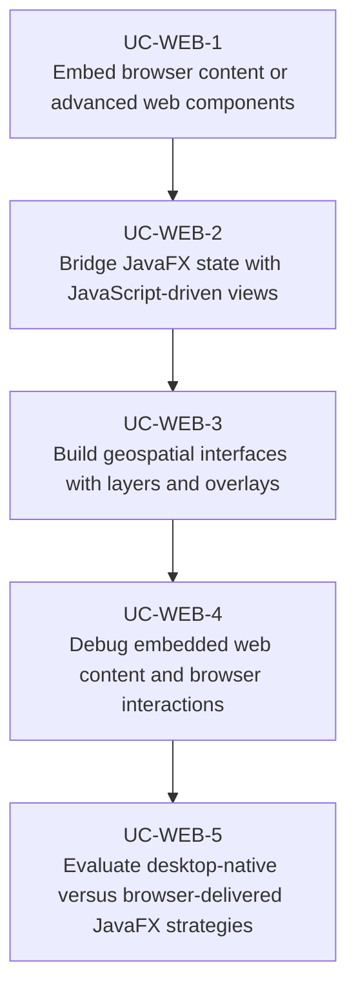

# Use Cases — JavaFX Web, Maps, and Embedded Integration

Derived from AwesomeJavaFX entries such as JxBrowser, Webview Debugger, jpro, WebFX, GMapFX,
Gluon Maps, JavaFX DataViewer, javafx-d3, and ResumeFX.

## Integration Choice

## Primary Use Cases

## Candidate skills from this domain

- Skill for WebView / embedded browser integration and Java-JS communication
- Skill for geospatial JavaFX UIs with maps, markers, layers, and overlays
- Skill for hybrid JavaFX/web visualisation pipelines
- Skill for deciding when to deliver JavaFX in the browser versus as a native desktop app

## Key gotchas

- Browser embedding changes security, debugging, and packaging constraints significantly.
- Map widgets need clear ownership of projection, overlay updates, and interaction state.
- Hybrid JavaFX/web flows are product architecture decisions, not just a widget choice.
