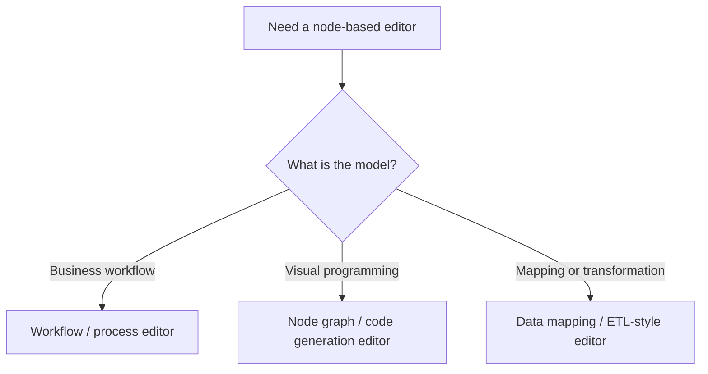
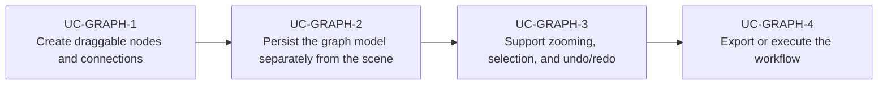

# Use Cases — JavaFX Workflow and Graph Editors

Derived from AwesomeJavaFX projects such as graph editor libraries, VWorkflows, and node-mapping
tools that let users build or edit connected workflows visually.

## Workflow Editor Flow

## Primary Use Cases

## Skill opportunities

- Skill for building custom node graph editors with JavaFX scene graph primitives
- Skill for separating graph model, view, and command history from the UI layer
- Skill for zooming, panning, snapping, and connection routing in visual editors

## Key gotchas

- If the graph model lives only in the scene graph, undo/redo and persistence become fragile.
- Large node graphs need virtualized rendering or culling strategies.
- Connection routing and hit testing become a product feature, not just a rendering detail.
